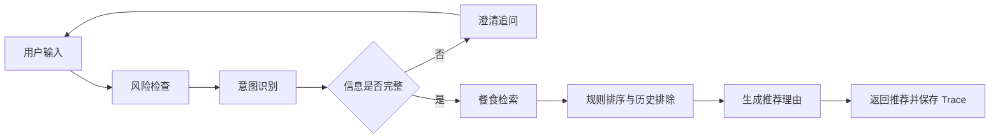

# 饮食推荐智能体（Diet Agent）

一个面向日常饮食决策的智能推荐项目。系统结合用户当前的用餐时段、情绪、场景、健康目标、菜系偏好、口味和便利性要求，通过规则与大模型协作完成意图识别、信息澄清、风险提示、候选检索、排序和推荐理由生成。

项目同时提供可直接使用的 Web 页面、完整后端接口、推荐过程 Trace，以及面向真实模型和故障场景的评估工具。

## 核心功能

- **对话式推荐**：理解自然语言需求，缺少关键信息时主动追问，再生成餐食建议。
- **多维偏好建模**：支持用餐时段、情绪、场景、健康目标、菜系、口味和便利性七类槽位。
- **健康风险防护**：识别高风险饮食诉求，在推荐前给出必要提示和约束。
- **餐食库管理**：区分公共餐食与个人餐食，支持个人餐食的新增、修改和删除。
- **推荐反馈**：记录用户对推荐结果的反馈，为后续评估和优化保留数据。
- **链路追踪与评估**：保存意图、槽位、候选、排序和最终回答等 Trace，支持人工标注与量化评估。

## 技术栈

| 分类 | 技术 |
| --- | --- |
| 后端 | Java 21、Spring Boot 3.3、MyBatis |
| 智能体 | AgentScope Java、通义千问 DashScope |
| 数据库 | MySQL 8 |
| 前端 | HTML、CSS、原生 JavaScript |
| 测试与评估 | JUnit 5、Mockito、Python 评估脚本 |

## 处理流程



## 项目结构

```text
src/main/java/com/diet
├─ agent/          Agent 构建、工厂与 Prompt 加载
├─ controller/     会话、对话、餐食、反馈、Trace 和评估接口
├─ service/        意图、澄清、风险、检索、排序与编排逻辑
├─ mapper/         MyBatis 数据访问接口
└─ model/          请求、响应和领域模型

src/main/resources
├─ db/             数据库初始化脚本
├─ diet/prompts/   各智能体 Prompt
├─ mapper/         MyBatis XML 映射
└─ static/         Web 页面与静态资源

eval/              评估语料、脚本、指标和历史报告
```

## 本地运行

### 1. 环境要求

- JDK 21
- Maven 3.9+
- MySQL 8
- 可用的 DashScope API Key

### 2. 初始化数据库

创建名为 `diet_db` 的数据库，然后导入：

```text
src/main/resources/db/diet_db.sql
```

可以使用 MySQL Workbench 导入，也可以通过命令行执行：

```powershell
mysql -u root -p -e "CREATE DATABASE IF NOT EXISTS diet_db CHARACTER SET utf8mb4;"
cmd /c "mysql -u root -p diet_db < src\main\resources\db\diet_db.sql"
```

### 3. 配置环境变量

PowerShell 示例：

```powershell
$env:DB_URL = "jdbc:mysql://localhost:3306/diet_db?useUnicode=true&characterEncoding=utf8&serverTimezone=Asia/Shanghai&useSSL=false&allowPublicKeyRetrieval=true"
$env:DB_USERNAME = "root"
$env:DB_PASSWORD = "你的数据库密码"
$env:DASHSCOPE_API_KEY = "你的 DashScope API Key"
```

其他可选配置：

| 环境变量 | 用途 | 默认值 |
| --- | --- | --- |
| `DASHSCOPE_BASE_URL` | DashScope 服务地址 | 项目配置中的地址 |
| `PORT` | Web 服务端口 | `8080` |

所有密钥和密码都应通过本地环境变量或部署平台的密钥管理功能注入，请勿提交到代码仓库。

### 4. 启动项目

```powershell
mvn spring-boot:run
```

启动后访问：<http://localhost:8080/>

## 测试

运行 Java 测试：

```powershell
mvn test
```

评估框架还支持冒烟、真实模型和故障注入三种模式。详细说明见 [评估指南](eval/README.md)，历史结果见 [评估结果](eval/RESULTS.md)。

## 接口概览

所有业务接口以 `/api/v1/diet` 为前缀，主要包括：

- `/sessions`：创建会话
- `/chat`：对话式饮食推荐
- `/meals/public`：查询公共餐食
- `/meals/personal`：管理个人餐食
- `/slot-options`：查询可用槽位标签
- `/feedback`：保存推荐反馈
- `/debug/traces`：查询和标注推荐 Trace
- `/evaluations`：执行单次链路评估

## 说明

本项目用于展示智能体编排、规则与大模型协作、推荐可追踪性及评估工程实践。饮食建议仅供日常参考，涉及疾病、过敏、用药或特殊营养需求时，应咨询医生或注册营养师。
